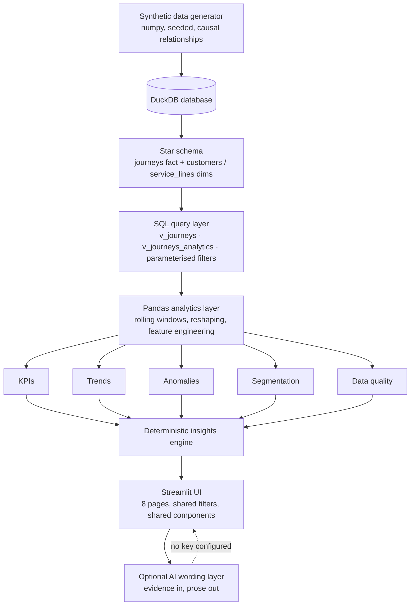

# Customer Intelligence Studio

**Interactive Customer & Mobility Analytics with AI-Assisted Decision Support**

An interactive analytics application that turns journey-level customer and operational
records into decisions: headline KPIs with period-over-period comparison, customer
segmentation, service performance analysis, statistical anomaly detection, data-quality
monitoring, and a grounded natural-language query interface.

> **Portfolio demonstration using synthetic data. Not affiliated with Transport for NSW.**
> All data is generated programmatically from a fixed random seed. No real customer,
> health, employer or operator data appears anywhere in this project.

**Live demo:** _(deploy to Streamlit Community Cloud and paste the URL here)_

---

## Screenshots

_Add screenshots to `assets/` and reference them here after your first deployment._

| View | File |
| --- | --- |
| Executive Overview | `assets/executive-overview.png` |
| Service Performance | `assets/service-performance.png` |
| Anomaly Detection | `assets/anomaly-detection.png` |
| Ask the Data | `assets/ask-the-data.png` |

---

## Key features

- **Executive Overview** - six headline KPIs, each showing the current period, the
  previous equal-length period and the change in the correct units (percentage points
  for rates, minutes for delay). Trends with a 7-day rolling average, breakdowns by mode,
  region and segment.
- **Global filtering** - date range, region, transport mode, customer segment, service
  line, channel, time band and journey purpose. Filters persist across pages and the
  selected analytical population is stated explicitly ("Analysing 12,483 journeys across
  3 regions").
- **Customer Explorer** - segment composition, experience by segment, channel and purpose
  preference, customer-level engagement bands, and a two-segment comparison.
- **Service Performance** - on-time performance, P90 delay, disruption rate; breakdowns by
  region, mode, service line and time band; peak-hour profiles and a day-by-hour heatmap;
  an interactive record table with search, subset filters, configurable columns and CSV
  export.
- **Segmentation** - documented behavioural rules *and* standardised K-means with a
  silhouette score, elbow curve, centroid-derived cluster names, a cross-tab against the
  rule segments, and stated limitations.
- **Anomaly Detection** - trailing rolling mean/standard deviation or IQR, with expected
  ranges, magnitude, severity and deterministic supporting context.
- **Data Quality** - nine rules across completeness, validity and uniqueness; field-level
  completeness; outlier counts; a weighted score; and a plain explanation of how each
  issue affects the numbers on the other pages.
- **Ask the Data** - questions routed to one of ten named analytical functions, answered
  from computed evidence, with the evidence shown beneath every answer.
- **Executive Brief** - a downloadable Markdown/text summary built from deterministic
  analytics.
- **Bring your own CSV** - optional upload validated against the canonical schema, held
  in memory for the session only.

---

## Technology stack

| Technology | How it is used |
| --- | --- |
| Python 3.10+ | All application and analytics code |
| Streamlit | Multi-page app, caching, session state, widgets |
| DuckDB | Analytical database: star schema, views, all aggregation |
| SQL | Filtering, aggregation, KPIs, window functions, period comparison |
| Pandas | Rolling statistics, reshaping, feature engineering, chart prep |
| Plotly | Every chart, from one shared visual specification |
| scikit-learn | StandardScaler + KMeans + silhouette for the clustering view |
| pytest | 100+ tests over the analytics, SQL layer and data rules |
| Ruff | Linting and format checking |
| GitHub Actions | Lint + tests on push and pull request, on 3.10 and 3.12 |
| OpenAI API | **Optional** wording layer only |

**Not used, and not claimed:** Snowflake, Databricks, Azure Data Platform, Tableau,
Power BI, Dash. See [`docs/skills-matrix-evidence.md`](docs/skills-matrix-evidence.md)
for an honest mapping of what this project does and does not demonstrate.

---

## Architecture



**Why this shape.**

- **The database does the aggregation.** Collapsing 60,000 journeys into a handful of
  rows is what SQL is for. Nothing loads the full dataset into memory to answer a
  question, so the app stays responsive as data grows.
- **Pandas takes over where SQL is awkward** - trailing rolling baselines, pivoting into
  chart shapes, and building the customer feature matrix.
- **Analytics never imports Streamlit.** Every calculation is a plain function over a
  connection and a filter object, which is why the test suite can exercise all of it
  without a browser.
- **Pages contain no calculations.** A metric is defined once, in the metric registry, so
  the Executive Overview, the insights engine and the AI assistant cannot disagree.

### What runs in SQL and what runs in Pandas

| Work | Where | Why |
| --- | --- | --- |
| Filtering by date and dimension | **SQL** | Pushes the predicate to the data; only matching rows are ever read |
| KPI aggregation, rates, percentiles | **SQL** | One scan per question; `FILTER (WHERE ...)` gives null-aware rates |
| Grouping by dimension, day, week, month | **SQL** | Returns tens of rows instead of tens of thousands |
| De-duplication and validity rules | **SQL** | A view, so no query can accidentally bypass them |
| Customer feature aggregation | **SQL** | 60,000 journeys collapse to a few thousand customer rows before Python sees them |
| Rolling means and standard deviations | **Pandas** | Order-dependent window logic, expressed far more clearly than in SQL |
| Reindexing gap-free calendars, pivots | **Pandas** | Reshaping for charts |
| Standardisation and clustering | **Pandas + scikit-learn** | Operates on the small customer matrix |
| Formatting and chart preparation | **Pandas** | Presentation, not computation |

---

## Data model

A small star schema. The fact table carries the journey grain; dimension attributes that
do not belong on a journey live on the dimensions and are joined back in a view.

```
service_lines                journeys (fact)                 customers
-------------                ---------------                 ---------
service_line       <-------- service_line                    customer_id --------> customer_id
transport_mode               journey_id (PK)                                       customer_segment
region                       customer_id (FK)                                      age_group
scheduled_duration_minutes   date, timestamp                                       home_region
reliability_index            region, origin_region, destination_region             fare_type
capacity_index               transport_mode, journey_purpose                       repeat_customer
                             customer_segment, age_group, channel                  digital_affinity
                             journey_duration_minutes, delay_minutes, on_time      first_seen_date
                             customer_satisfaction, complaint_flag,
                             complaint_category, resolution_time_hours
                             repeat_customer, service_disruption,
                             accessibility_service_used, fare_type,
                             digital_interaction, feedback_text_category
```

Two views sit on top:

- **`v_journeys`** - every row, enriched with dimension attributes and derived time
  columns (`journey_hour`, `day_of_week`, `is_weekend`, `is_peak`, `time_band`,
  `week_start`, `month_start`). This is what the Data Quality page profiles, because
  quality must be measured on the raw feed.
- **`v_journeys_analytics`** - the subset passing hard validity rules, de-duplicated on
  `journey_id` with a window function. Every analytical query reads this view, so
  impossible values cannot reach a KPI. The gap between the two row counts is reported
  on the Data Quality page.

### Synthetic dataset

60,000 journeys, 9,000 customers, 48 service lines, 18 months of daily history, built
from a fixed seed (`RANDOM_SEED = 4257`). Relationships are causal, not random:

- Delay is driven by line reliability, peak hour, region, day of week and disruption.
- Satisfaction falls with delay, disruption, crowding and slow complaint resolution.
- Complaints rise with delay, disruption and segment service-need.
- Demand carries weekly, seasonal and holiday patterns plus a gentle growth trend.
- Four **anomaly windows** are injected (a regional delay spike, a three-day demand
  surge, a mode-level complaint surge, and a regional reliability improvement) so the
  detector has something real to find. The test suite asserts it finds them.
- Realistic defects are added last: missing values, duplicated rows, and impossible
  values such as negative durations and a `999` delay sentinel.

The dataset is generated on first run and cached in `data/generated/`. A manifest
fingerprint over the seed, size and date range decides whether to rebuild.

---

## Analytics

- **Period comparison.** The previous period is always the equal-length window
  immediately before the selection. Rate metrics are compared in percentage points;
  counts in absolute and relative terms.
- **Null-aware rates.** `100.0 * count(*) FILTER (WHERE x) / nullif(count(*) FILTER
  (WHERE x IS NOT NULL), 0)` - missing values shrink the denominator instead of counting
  as zero.
- **Anomaly detection.** For each day, a baseline is built from the previous 28 days,
  with the tested day excluded from its own baseline. Rolling z-score is the default;
  IQR is available as a more robust alternative. Minimum daily volume and minimum
  absolute movement floors stop a quiet day producing a headline. Baseline history is
  read from *before* the selected window, so filtering to the last 30 days still works.
- **Segmentation.** Five documented behavioural rules evaluated in priority order, plus
  optional K-means on standardised features with silhouette and elbow diagnostics.
  Cluster names are derived from centroid positions, so they are readable and stable.
- **Insights.** Ten generators, each producing a headline, a detail sentence and the
  evidence dictionary it was computed from. Ranked by effect size, with stable ordering.

---

## AI-assisted analytics

```
Your question
      |
      v  keyword scoring + entity extraction over a fixed vocabulary
Question classification -> selects exactly one of ten named tools
      |
      v  the same analytics functions the rest of the app uses
Deterministic analytics -> SQL + Pandas
      |
      v
Structured evidence + a complete, written answer
      |
      v  optional, only if OPENAI_API_KEY is set
Language model -> rewords the answer; adds no numbers
      |
      v
Answer + "Evidence used" panel
```

The model never receives database access, never chooses a calculation and never sees
row-level data - only aggregated evidence. The prompt forbids computing or estimating
any figure, and the evidence is displayed beneath every answer so a deviation is visible
immediately. If the API call fails, the deterministic answer is shown with a note; the
page does not error.

**The entire application works without an API key.** Dashboards, filtering, segmentation,
anomaly detection, data quality, the insights engine, the executive brief and Ask the
Data are all fully functional. Only the optional rewording step is skipped.

---

## Data quality

Nine rules across three families, weighted into a 0-100 score
(40% completeness, 40% validity, 20% uniqueness):

| Family | Checks |
| --- | --- |
| Completeness | Null customer ID, missing region, missing satisfaction score |
| Validity | Satisfaction outside 1-5, non-positive duration, implausible duration, impossible delay, unrecognised transport mode |
| Uniqueness | Duplicate journey ID |

The page also reports field-level completeness (flagging conditionally-populated fields
so their expected sparsity does not distort the average), statistical outliers beyond
3x IQR, data freshness, and an explicit account of how each issue changes the numbers
elsewhere in the app.

---

## Testing

```bash
pytest
```

Around 100 tests covering the parts where a silent error would be most damaging:

- **KPIs** - every registered metric executes; totals reconcile with a direct SQL count;
  on-time performance matches a hand-written null-aware calculation; deltas are
  arithmetically consistent; metric polarity drives the good/bad direction; breakdowns
  sum back to the total; an empty population returns `None` rather than raising.
- **Filters** - normalisation, inclusive period length, non-overlapping previous period,
  values bound as parameters and never interpolated, alias handling, hashability for
  caching, and that each filter genuinely narrows the population.
- **Database** - schema matches the canonical column list; views expose derived columns
  and joined dimensions; the analytics view excludes invalid rows and de-duplicates IDs;
  unknown filter columns are rejected; a minimal uploaded schema works end to end.
- **Anomalies** - the detector finds the anomalies the generator deliberately planted;
  expected ranges are coherent; statements are deterministic; sensitivity behaves
  monotonically; findings stay inside the selected window.
- **Data quality** - every injected defect is detected; excluded rows equal the gap
  between the two views; a genuinely clean dataset scores 100.
- **Generator** - identical config produces identical frames; a different seed does not;
  delay reduces satisfaction; disruption increases complaints; peaks carry more delay;
  weekends are quieter.
- **Analytics and AI** - segmentation determinism and coverage, insight stability,
  brief completeness, SQL-injection-safe record search, question routing for every
  supported question, every tool runs, and answers work with AI disabled.

---

## Local development

```bash
# 1. Clone and enter the project folder
cd customer-intelligence-studio

# 2. Create a virtual environment
python -m venv .venv

# macOS / Linux
source .venv/bin/activate
# Windows (PowerShell)
.venv\Scripts\Activate.ps1
# Windows (Git Bash)
source .venv/Scripts/activate

# 3. Install dependencies
pip install -r requirements.txt
# for development (adds pytest and ruff)
pip install -r requirements-dev.txt

# 4. Run the app
streamlit run app.py
```

The app opens at <http://localhost:8501>. The dataset builds automatically on first run
(about one second) and is cached in `data/generated/`.

```bash
# Optional: enable the AI wording layer
cp env.example .env      # then add your key to .env
```

> The template is named `env.example` rather than `.env.example` because this machine has
> a global rule blocking writes to `.env*` paths. Rename it if you prefer the
> conventional name: `git mv env.example .env.example`.

```bash
# Quality checks
ruff check .
ruff format --check .
pytest
```

---

## Deployment

### Streamlit Community Cloud (recommended)

1. Push this repository to GitHub.
2. Go to <https://share.streamlit.io> and select **New app**.
3. Configure:
   - **Repository:** your repository
   - **Branch:** `main` (or your default)
   - **Main file path:** `customer-intelligence-studio/app.py`
   - **Python version:** 3.11 or 3.12
4. *(Optional)* Under **Advanced settings -> Secrets**, add:
   ```toml
   OPENAI_API_KEY = "sk-..."
   ```
   Skip this entirely if you do not want AI wording; every other feature still works.
5. Deploy. The first run generates the dataset inside the container.

The project is **self-contained**: it reads no files outside this folder, has no external
database, needs no credentials, and uses only relative POSIX-compatible paths. It deploys
independently of anything else in the repository.

### Running elsewhere

```bash
pip install -r requirements.txt
streamlit run app.py --server.port 8501 --server.address 0.0.0.0
```

Or in a container: `python:3.12-slim`, `pip install -r requirements.txt`, then
`streamlit run app.py`. No system packages are required.

---

## Performance

The app is built to stay responsive with tens of thousands of records:

- **`@st.cache_resource`** holds the DuckDB connection - a handle, created once per
  session, never copied.
- **`@st.cache_data`** caches query *results*, keyed by the SQL text and bound
  parameters, with a 30-minute TTL. Changing a filter is a cache miss; toggling a chart
  is not.
- **Aggregation is pushed into SQL.** A KPI row is one scan returning one row; the
  browser never receives 60,000 records.
- **The record table is paged and sorted in the database** with `ORDER BY ... LIMIT`,
  and columns are chosen before the query runs.
- **Filter option lists are cached separately** - they change only when the dataset does.
- **The dataset is generated once** and reused via a manifest fingerprint.
- **One query serves many metrics.** The anomaly scan fetches every metric it needs for
  every scope in a single grouped query, then does the windowing in Pandas.

Indicative timings on the 60,000-row demo dataset (local, cold cache): dataset generation
0.4 s, database build 1.1 s, KPI comparison 0.9 s, anomaly scan across six regions 0.4 s,
full insight generation 0.8 s. Warm cache interactions are effectively instant.

---

## Security and privacy

- The demo dataset is **entirely synthetic**; there is no personal data to protect.
- **Uploaded files are parsed in memory** for the session only. They are never written to
  disk and never persisted between sessions.
- **Uploaded data is not sent anywhere** unless you explicitly enable AI wording, and the
  page warns you before that is possible. Even then, only **aggregated figures** are sent -
  never individual records.
- **No secrets are committed.** `env.example` documents the variable; `.env` and
  `.streamlit/secrets.toml` are git-ignored.
- **All SQL is parameterised.** Values are bound; only column names are interpolated, and
  those come from fixed allow-lists (`FILTER_COLUMNS`, `GROUPING_COLUMNS`), so user input
  cannot reach the SQL text. There is a test for this.

---

## Limitations

- The data is synthetic. Findings describe the generator's behaviour, not the real world,
  and must not be presented as transport research.
- DuckDB runs single-node. The design suits millions of rows on one machine, not a
  distributed warehouse.
- Segments and clusters demonstrate technique; they are not validated customer research.
- Question classification is keyword-based, not a learned intent model. It is transparent
  and testable, but it will not understand an arbitrary question - the supported set is
  listed in the UI.
- There is no authentication. It is a public demonstration by design.
- Anomaly detection assumes a roughly stable baseline; a step change becomes the new
  normal after the rolling window passes over it.

---

## Future improvements

- Push the customer feature matrix into SQL entirely and cluster incrementally.
- Add a forecasting page (seasonal-naive baseline, then Prophet or a state-space model)
  with backtested accuracy shown alongside the forecast.
- Support Parquet and a real warehouse connector behind the existing `DataSource`
  abstraction, so the same analytics run against DuckDB, Postgres or Snowflake.
- Add a scheduled job that writes the executive brief to a shared location.
- Row-level access control and SSO for internal deployment.
- Snapshot-test the Plotly figures to catch visual regressions in CI.

---

## Portfolio context

Built to demonstrate practical, end-to-end capability for a **Customer Analytics
Applications Specialist** role: designing a data model, doing the analytical work in SQL,
building a usable interactive application on top, being explicit about data quality, and
integrating AI in a way that is grounded and defensible rather than decorative.

Supporting documents:

- [`docs/skills-matrix-evidence.md`](docs/skills-matrix-evidence.md) - an honest,
  conservative mapping of this project against the advertised skills, including what it
  does **not** demonstrate.
- [`docs/interview-guide.md`](docs/interview-guide.md) - technical questions and answers
  based only on what is actually built.

---

## Licence

MIT - see [LICENSE](LICENSE).
